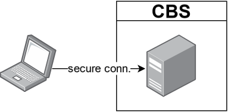

# Workshop efficient microdata
Materials for a half-day workshop on efficient projects using CBS microdata. The materials on this page are [CC-BY-4.0](https://creativecommons.org/licenses/by/4.0/) licensed.

 

## Schedule
- Interactive instruction (2 hours)
    - Fundamentals of the CBS RA
    - Project structure & reproducibility
    - Code efficiency
- Exercise & consultation in groups (1 hour)

## Materials

- [__Slides__](./efficient_microdata.pdf) (pdf, without fancy gifs 😉)
- [__Materials__](https://github.com/sodascience/workshop_efficient_microdata/archive/refs/heads/main.zip) (to follow along with the materials and live coding sessions). After downloading, unzip and double click on the file `workshop_efficient_microdata.Rproj`.
- [__Exercise data__](https://surfdrive.surf.nl/files/index.php/s/MkCfPR4SF3md5Rm) (11.7 GB) to download and put in the folder `fake_cbs_data/Spolis`.

## Contact

This project is developed and maintained by the [ODISSEI Social Data
Science (SoDa)](https://odissei-soda.nl/) team.

For questions about this course, you can contact us at [soda@odissei-data.nl](mailto:soda@odissei-data.nl), or you can contact the instructor Erik-Jan ([e.vankesteren1@uu.nl](mailto:e.vankesteren1@uu.nl)) directly.